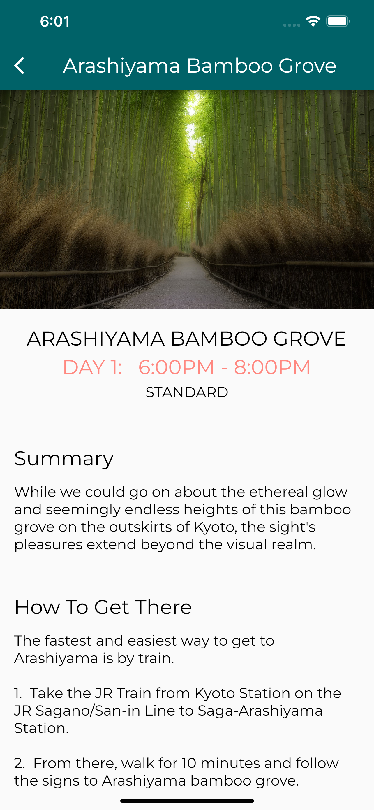
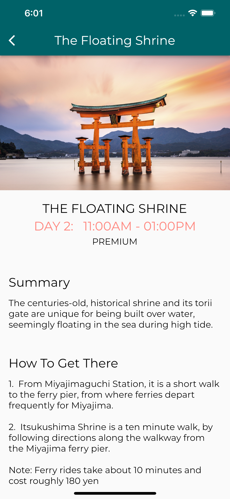

# flutter_tutorial

## Overview
This repository contains code that serves as an introduction to flutter by building a tourism concept app that presents beautiful travel destinations where people can read up on details.

Content covered includes:
1. Basics of Scaffold
2. Layout Basics, Column, Text, Image and StatelessWidget
3. Lists using ListView, leveraging Models and Navigation
4. StatefulWidget fundamentals
5. Form basics with TextFormField, Checkbox and RasiedButton

and possibly (once I get around to doing...):

6. Fetching data with web services using json_serializeable
7. Managing state and reactive widgets with scoped_model
  

## Sample

### **App home page display**

  

### **Destination #1 display**

  

### **Destination #2 display**

  

## Credits
Here's the guide to get started with the basic layout: ["Tutorial Guide"](https://www.youtube.com/watch?v=pTJJsmejUOQ&t=279s) by flutter engineer ["Nick Manning"](https://github.com/seenickcode).
